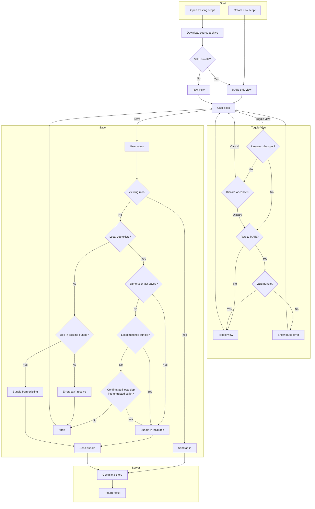

# RFC: Static require() for ServerLua

* Status: **DRAFT**

## Summary

Compile-time static `require()` resolution that bundles multiple modules into a single deployable unit. Client-side bundling
avoids the kind of security issues (see MySQL's `LOAD LOCAL`) where the server has to tell the client what local resources are needed
to continue bundling, and the client can't reason about what resources are needed on its own. Preserves original filenames and line numbers
for debugging via per-Proto source info in bytecode.

## Motivation

**Problem:** No code reuse beyond copy-paste in-viewer. Large scripts are unwieldy. LSL's `#include` loses dependency info after processing,
 if you don't have the local dependencies you have no option but to edit the post-processed source code soup.

**Why static `require()`:** SL's creation and permission models don't play nice with dynamic runtime dependencies. Bundling together dependencies when
 building makes it easy for us to support multiple development styles (external editor with custom build toolchain, in-viewer editor have different opinions about
 how to include files and from where)

**Why it's tricky:** Server compiles, but dependencies live on client. Can't reasonably have server request files (i.e. `LOAD LOCAL` from MySQL).
Need debug info across modules. Want future tree shaking/inlining for optimization purposes.

## Path Resolution

All paths are explicit - no relative paths (`./`, `../`).

| Pattern | Resolves to                                                                           |
|---------|---------------------------------------------------------------------------------------|
| `require("foo")` | `package.path`-like semantics. Includes from the top of the package, or from libs dir |
| `require("@myalias/utils")` | User-configured alias → local path                                                    |
| `require("@sl/json")` | Platform libs (reserved namespace for LL-provided native Lua libs)                    |

**Client resolves aliases before bundling.** Bundle stores alias paths; runtime does simple string lookup when actually
 calling `require()`

## Bundle Format

Text-based, valid Luau syntax, lightly inspired by MIME multipart RFC:

```lua
--[[!!SLUA:BUNDLE!!]]
-- NOTE: May have some metadata in the header too
-- MAIN is implicit (first section after header)
local foo = require("@myproject/lib/foo")
local json = require("@sl/json")
foo.bar()

--[[!!SLUA:MODULE:@myproject/lib/foo!!]]
local helpers = require("@myproject/lib/helpers")
return { bar = function() return helpers.helper() end }

--[[!!SLUA:MODULE:@myproject/lib/helpers!!]]
return { helper = function() return "hello" end }
```

**Rules:**
- `--[[!!SLUA:BUNDLE!!]]` header must be first line
- MAIN is implicit (content between header and first MODULE)
- `--[[!!SLUA:MODULE:path!!]]` marks each dependency
- `--[[!!SLUA:` in user source is rejected
- Platform libs (`@sl/...`) not included - provided by runtime
- Generally the user only sees and directly edits the `MAIN` bit of the bundle
- Users may define their own global aliases that refer to particular libs on their disk
- - For ex. you might `require("@textlib/v2")` to pull in v2 of your text rendering library

Conceptually, the bundle provides a sort of virtual filesystem for the runtime `require()` implementation.

Notably, since the bundle format includes the source code as-is, before any optimization and tree-shaking, file name
and line mappings for errors are automatically correct, without `--!@line` directives or similar.

## Editing Workflow



**Key points:**
- MAIN-only view: user sees entry script, client bundles on save
- Raw view: user sees/edits full archive, sent as-is
- Ownership check: security measure to prevent leaking local code into scripts others control
- - Open question as to how this should work, we'll need to do some server-side enrichment
- Fallback: if local dep missing, use version from downloaded bundle
- - This allows users to do one-off edits to scripts from the viewer even if they don't have all the
    constituent parts on their drives.

## Runtime

- `require()` implemented in C (hides module table/cache from scripts)
- Module results cached after first execution
- Each module runs in sandboxed environment via `dangerouslyexecuterequiredmodule()`
- - This function will be hidden from view and not directly usable.
- Simple string lookup - no alias resolution at runtime

## Bytecode Extension

**Problem:** Standard Luau shares one `chunkname` across all functions. Bundles have multiple
 source files. It's useful to be able to have proper filename and line mappings in errors.

**Solution:** Per-Proto source in bytecode. Each function stores its source filename. Loader reads per-function source for correct stack traces.

```cpp
// In lvmload.cpp
TString* protoSource = hasPerProtoSource
    ? strings[readVarInt(data, size, offset)]
    : source;  // Fallback for non-bundles
p->source = protoSource;
```

## Errors

| Error | When | Message |
|-------|------|---------|
| Dynamic require | Compile | `require() argument must be a string literal` |
| Relative path | Compile | `relative paths not supported` |
| Unknown alias | Compile | `unknown alias '@foo' in require` |
| Module not found | Compile | `cannot find module '<path>'` |
| Circular dependency | Compile | `circular dependency: <path1> -> <path2> -> <path1>` |
| Delimiter in source | Compile | `source cannot contain '--[[!!SLUA:'` |
| Depth exceeded | Compile | `require depth exceeds maximum` |
| Module not in bundle | Runtime | `module not found: <path>` |

## Limits

- Max dependency depth: 100
- Max total modules: 1000
- No circular dependencies (no different from typical Luau here!)

## Future Work

- Tree shaking (eliminate unused exports)
- Cross-module inlining (`--!pure` modules)
- Inventory-based module resolution
