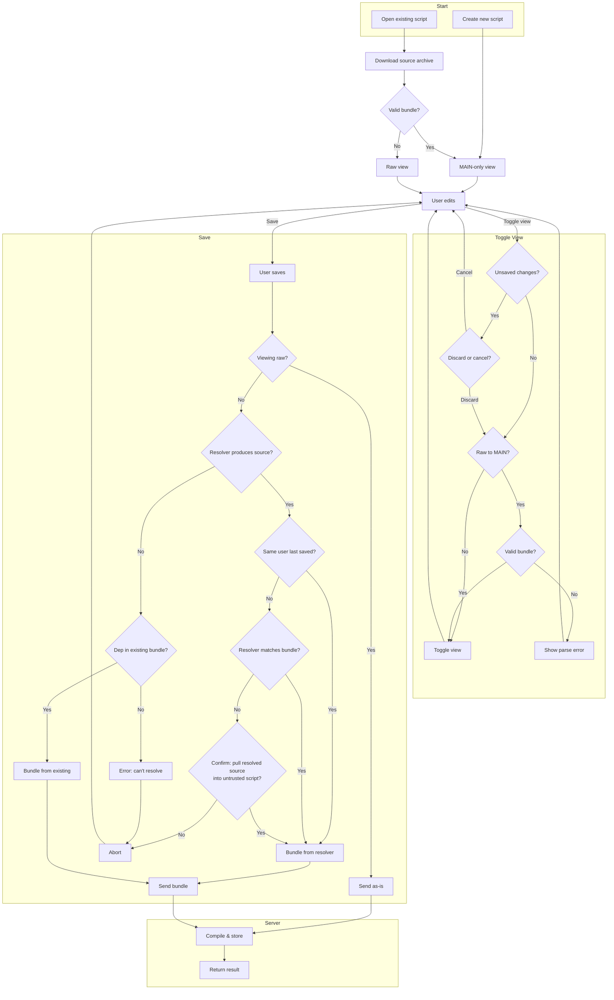

# RFC: Static require() for ServerLua

* Status: **DRAFT**
* Reference implementation: [`tools/slua_bundle/`](../tools/slua_bundle/)

## Summary

Compile-time static `require()` resolution that bundles multiple modules into a single deployable unit. Client-side bundling
avoids the kind of security issues (see MySQL's `LOAD LOCAL`) where the server has to tell the client what local resources are needed
to continue bundling, and the client can't reason about what resources are needed on its own. Preserves original filenames and line numbers
for debugging via per-Proto source info in bytecode.

SLua intentionally reuses upstream Luau ecosystem conventions where they exist - `.luaurc` for aliases, `init.luau` for module-as-directory entries,
Wally-style project layout - so existing Roblox/Luau tooling works without modification. SLua adds the bundle format and per-Proto source bytecode
on top; configuration is not a SLua extension surface.

## Motivation

**Problem:** No code reuse beyond copy-paste in-viewer. Large scripts are unwieldy. LSL's `#include` loses dependency info after processing,
 if you don't have the local dependencies you have no option but to edit the post-processed source code soup.

**Why static `require()`:** SL's creation and permission models don't play nice with dynamic runtime dependencies. Bundling together dependencies when
 building makes it easy for us to support multiple development styles (external editor with custom build toolchain, in-viewer editor have different opinions about
 how to include files and from where)

**Why it's tricky:** Server compiles, but dependencies live on client. Can't reasonably have server request files (i.e. `LOAD LOCAL` from MySQL).
Need debug info across modules. Want future tree shaking/inlining for optimization purposes.

## Path Resolution

**Aliases are pure identity, not location.** A `require("@alias/path")` call is a logical name for a module. The path
never encodes where the module is fetched from or what kind of resolver produced it. Two scripts that share an alias
path are referring to the same logical module regardless of how each environment resolved it.

| Pattern | Meaning                                                                                       |
|---------|-----------------------------------------------------------------------------------------------|
| `require("@root/utils")` | The built-in `@root/` alias always points to the project root. See [Built-in aliases](#built-in-aliases). |
| `require("@myalias/utils")` | User-declared alias from `.luaurc`. Resolved by the bundler; canonical bundle key is the alias path itself. |
| `require("./foo")`, `require("../foo")`, `require("@self/foo")` | Location-dependent. Canonicalized to absolute alias form at bundle time; see [Canonicalization](#canonicalization). |

Bare identifiers (`require("foo")`) are not valid - upstream Luau already rejects anything without a `./`, `../`, or
`@` prefix. The `@sl/` namespace is reserved for future use.

**Bundlers resolve aliases at bundle time.** The bundle stores each module under its canonical absolute alias key.
Runtime `require()` is a simple string lookup against the bundle's module table - no alias resolution at runtime.

### Built-in aliases

- `@root/` — always points to the project root. Lets scripts reference project-internal modules without depending on
  the project's PROJECT name. Reserved: `.luaurc` may not declare an alias named `root`.
- `@self/` — upstream Luau convention: "current module's directory" (relative to the requiring file). Treated by the
  resolver, not by `.luaurc`. Reserved — `.luaurc` may not declare an alias named `self`.

Project-internal canonical keys always have the form `@root/...`, regardless of the bundle's PROJECT name. PROJECT is
viewer-linkage metadata only and never appears in canonical keys.

### Canonicalization

Every module is keyed in the bundle under an absolute alias path. The bundler rewrites the require's string constant
in emitted bytecode so runtime lookup matches that key directly.

```mermaid
flowchart TD
    Start[require S from module R]
    Start --> Kind{S starts with}
    Kind -->|@alias/...| Direct[Canonical key = S]
    Kind -->|./, ../, @self/| Resolve[Resolve against R's location -> physical path L]
    Resolve --> FindAlias{Most-specific covering alias for L}
    FindAlias -->|Found| Build["Canonical key = @alias/{L relative to target}"]
    FindAlias -->|None| NoAliasErr["Error: no alias spans L (shouldn't happen: @root always covers project_root)"]
    Direct --> Done[Stored in bundle module table]
    Build --> Done
```

The covering-alias set always includes `@root` for `project_root`, so files under `project_root` always canonicalize
cleanly. Files outside `project_root` need an explicit `.luaurc` alias spanning them.

MAIN is canonicalized identically: the `MAIN` directive's value acts as MAIN's anchor key, exactly
as the MODULE marker acts for module bodies. MAIN is always present in well-formed bundles.

**Tiebreaker for identical-target aliases.** Specificity is by number of path components in the alias target (deeper
wins). When two aliases point at the exactly-same directory at the deepest covering tier:
- If `@root` is one of them, `@root` wins silently. Common case: a user declared a Wally-style alias for
  `project_root` in `.luaurc` not realizing `@root` already covers it.
- Otherwise, the alphabetically-first alias name wins (ASCII byte order), and the bundler emits a warning. This is a
  config smell — usually a copy-paste mistake in `.luaurc`. Alias names are assumed ASCII (Luau / Wally convention);
  non-ASCII alias names are unspecified.

**Worked example.** Inside `Packages/SomeLib/init.luau` with `.luaurc` defining `"SomeLib": "Packages/SomeLib"`:

```lua
local Module = require("./src/Module")
```

resolves physically to `Packages/SomeLib/src/Module.luau`. The most-specific covering alias is `@SomeLib`, so the
bundle key becomes `@SomeLib/src/Module` - identical to what `require("@SomeLib/src/Module")` would produce. Wally
packages canonicalize this way without any SLua-specific handling.

Same source tree + same `.luaurc` produces identical canonical keys regardless of which bundler ran; `.luaurc` ships
alongside the source. Resolvers returning virtual source (e.g. inventory) must declare an alias prefix for what they
return, or reject location-dependent requires inside it - a resolver concern, not the format's.

## Bundle Format

Text-based, valid Luau syntax, lightly inspired by MIME multipart RFC. The format is **producer-agnostic**: the viewer
and any external bundler emit the same artifact, and the server cannot tell which built it.

```lua
-- !!LUABUNDLE:VERSION 1
-- !!LUABUNDLE:PROJECT myhud
-- !!LUABUNDLE:MAIN @root/HudController
-- !!LUABUNDLE:BODY
local foo = require("@root/lib/foo")
foo.bar()
-- !!LUABUNDLE:MODULE @root/lib/foo
local helpers = require("./helpers")
return { bar = function() return helpers.helper() end }
-- !!LUABUNDLE:MODULE @root/lib/helpers
return { helper = function() return "hello" end }
```

**Directives** (each on its own line, line-comment form):

| Directive | Required | Purpose |
|-----------|----------|---------|
| `-- !!LUABUNDLE:VERSION <n>` | yes, first line | Bundle format version. Consumers MUST reject unknown versions. Future version bumps are non-back-compatible unless explicitly stated. |
| `-- !!LUABUNDLE:PROJECT <name>` | no | Advisory viewer-linkage metadata; associates the bundle with a disk project. Not used for canonicalization. See [Project Linkage](#project-linkage). |
| `-- !!LUABUNDLE:MAIN <canonical-key>` | yes | Canonical key for the MAIN section (e.g. `@root/HudController`). Anchors `./`, `../`, and `@self/` requires inside MAIN. Always emitted by the reference bundler; computed from MAIN's path under `project_root`. |
| `-- !!LUABUNDLE:BODY` | yes | Separates the header from MAIN's source body. Everything between BODY and the first MODULE marker (or EOF) is MAIN. |
| `-- !!LUABUNDLE:MODULE <canonical-key>` | per module | Marks each dependency. The canonical key identifies the module for runtime `require()` lookup. |

**Other rules:**
- Lines matching `^-- *!!LUABUNDLE:` in user source are rejected at bundle time. Users may not author lines that look like bundle directives.
- Generally the user only sees and directly edits the `MAIN` body of the bundle.
- Users may define their own aliases (via `.luaurc`) referring to libs on disk; see [Configuration & Project Layout](#configuration--project-layout).

The bundle conceptually provides a virtual filesystem for the runtime `require()` implementation. Because the format
includes source code as-is - before any optimization or tree-shaking - filenames and line mappings for errors are
automatically correct without `--!@line` directives.

## Configuration & Project Layout

SLua reuses Luau ecosystem conventions for project configuration. **No SLua-specific config file is introduced.**

### Alias config: `.luaurc`

`.luaurc` is the standard Luau alias config (JSON, Wally-compatible). SLua bundlers read it the same way `lune`, the
`luau` CLI, and Roblox Studio do:

```json
{
  "languageMode": "strict",
  "aliases": {
    "Pkg": "Packages"
  }
}
```

Project-internal modules don't need a user alias — the built-in `@root/` covers `project_root`. `.luaurc` is for
declaring external aliases (Wally packages, vendored libs, virtual-source resolvers, etc.). The alias name `root` is
reserved.

**SLua bundlers read only the `.luaurc` at `project_root`.** Nested `.luaurc` files deeper in the tree are ignored;
files above `project_root` are never consulted. This deviates from upstream Luau's walking behavior on purpose:
bundle reproducibility requires the alias set to be a function of the project tree alone. Walking up past
`project_root` would let aliases bleed in from whatever directory the developer happened to bundle from, breaking
identical-source-tree-gives-identical-canonical-keys.

### Recommended directory layout

Mirror Rojo/Wally idiom:

```
myhud/                   # project_root (any name; not load-bearing)
  .luaurc                # aliases for external deps (Wally-friendly, Roblox-compatible)
  wally.toml             # optional, Wally manifest
  Packages/              # Wally-vendored deps (e.g. @SomeLib)
  src/
    HudController.luau   # top of src/ -> SL script "HudController" (canonical: @root/src/HudController)
    DataLink.luau        # top of src/ -> SL script "DataLink"      (canonical: @root/src/DataLink)
    lib/
      utils.luau         # nested -> helper, @root/src/lib/utils
      shared.luau        # nested -> helper, @root/src/lib/shared
```

**Convention:** files at the **immediate root of `src/`** become SL scripts (one each, named after the disk filename).
Files in **any subdirectory** are project-local helpers, never deployed as standalone scripts. A CLI deploy tool
(`slua deploy <object-id>` or similar) reads the top of `src/`, bundles each top-level file with its required modules,
and uploads one SL script per file. No manifest is needed; the directory shape is the manifest.

This dissolves the question of what "the main file" is named at the script level: the SL script name *is* the disk
filename. There is no `main.luau` magic.

### Module-as-directory entry: `init.luau`

When an alias resolves to a directory (e.g., `require("@coollib")` where `coollib` is a directory), the entry file is
`init.luau`. **This is upstream Luau's convention** (see `Require/include/Luau/Require.h:33-34`), adopted unchanged so
SLua require behaves identically to Lute, Roblox, and the `luau` CLI for directory aliases. `init.luau` has no special
meaning at the SL-script level - only for module-as-directory.

### Wally compatibility

SLua projects are normal Luau projects. `wally install` populates `Packages/`, `.luaurc` aliases (`@Pkg/...`) point at
it, the bundler reads disk normally. No SLua-side configuration is needed beyond what any other Luau tool already
supports.

## Resolver Behaviour

A bundler maps an alias path to source code at bundle time. The RFC commits only to **minimum** behaviour and stays
silent on the rest:

- Bundlers **SHOULD** support `.luaurc`-based disk alias resolution. This is the Wally/Roblox compatibility floor.
- Bundlers **MAY** support additional resolvers (inventory, marketplace, http registries, etc.). These are entirely an
  implementation choice; the RFC neither enumerates nor specifies them.
- The bundle's embedded source is the **universal last-resort resolver**. Any bundler can rebundle a bundle it received -
  even if it cannot reach the original sources - by reusing the bundled copies of each module.

The last-resort resolver is what keeps a viewer-authored bundle re-buildable from an external CLI without inventory
access: when an alias has no local resolver, the bundler falls back to the source already embedded in the previous
bundle. The script never breaks just because the new environment lacks the original resolver.

## Project Linkage

The bundle header's optional `PROJECT <name>` directive lets a viewer associate a script with a local disk project
for editing. The RFC specifies the **contract** only:

- A viewer MAY maintain bindings from project names (and optionally per-object UUID overrides) to local disk directories.
- Resolvers see the path resulting from the binding; how it is stored is viewer business.
- Bindings are per-user-per-machine, never synced to SL servers, and not assumed identical between collaborators.
- Header is metadata only; an unset project name just means "no disk linkage known here." A bundler that ignores it
  works correctly.

### Non-normative appendix: registry sketch

A minimal viewer-internal registry could look like:

```json
{
  "projects": {
    "myhud":         "/Users/me/slua/myhud",
    "vendor-system": "/Users/me/slua/vending"
  },
  "objects": {
    "01234567-89ab-cdef-0123-456789abcdef": "/Users/me/slua/oldhud"
  }
}
```

Resolution order: object UUID override -> project header name -> unbound.

This appendix is illustrative. TPVs may store bindings however suits their codebase; only the contract above is
load-bearing.

Viewer-to-disk **sync-back** (writing MAIN edits back to a bound disk project) is deferred to a follow-up RFC.

## Editing Workflow


```mermaid
flowchart TD
    subgraph Start
        direction LR
        OpenExisting[Open existing script]
        CreateNew[Create new script]
    end

    DownloadArchive[Download source archive]
    IsValidBundle{Valid bundle?}
    MainView[MAIN-only view]
    RawView[Raw view]
    UserEdits[User edits]

    CreateNew --> MainView
    OpenExisting --> DownloadArchive
    DownloadArchive --> IsValidBundle
    IsValidBundle -->|Yes| MainView
    IsValidBundle -->|No| RawView
    MainView --> UserEdits
    RawView --> UserEdits

    UserEdits -->|Toggle view| CheckUnsaved
    UserEdits -->|Save| StartSave

    subgraph Toggle[Toggle View]
        CheckUnsaved{Unsaved changes?}
        TogglePrompt{Discard or cancel?}
        CheckToggleDir{Raw to MAIN?}
        ValidBundle{Valid bundle?}
        DoToggle[Toggle view]
        ShowParseError[Show parse error]

        CheckUnsaved -->|No| CheckToggleDir
        CheckUnsaved -->|Yes| TogglePrompt
        TogglePrompt -->|Discard| CheckToggleDir
        CheckToggleDir -->|No| DoToggle
        CheckToggleDir -->|Yes| ValidBundle
        ValidBundle -->|Yes| DoToggle
        ValidBundle -->|No| ShowParseError
    end

    subgraph Save
        StartSave[User saves]
        IsRawView{Viewing raw?}
        SendRaw[Send as-is]
        ResolverSucceeds{Resolver produces source?}
        CheckOwnership{Same user last saved?}
        BundleResolved[Bundle from resolver]
        CheckMatch{Resolver matches bundle?}
        ConfirmUntrusted{Confirm: pull resolved source\ninto untrusted script?}
        DepInBundle{Dep in existing bundle?}
        BundleFromBundle[Bundle from existing]
        ResolveError[Error: can't resolve]
        SendBundle[Send bundle]
        AbortSave[Abort]

        StartSave --> IsRawView
        IsRawView -->|Yes| SendRaw
        IsRawView -->|No| ResolverSucceeds
        ResolverSucceeds -->|Yes| CheckOwnership
        CheckOwnership -->|Yes| BundleResolved
        CheckOwnership -->|No| CheckMatch
        CheckMatch -->|Yes| BundleResolved
        CheckMatch -->|No| ConfirmUntrusted
        ConfirmUntrusted -->|Yes| BundleResolved
        ConfirmUntrusted -->|No| AbortSave
        ResolverSucceeds -->|No| DepInBundle
        DepInBundle -->|Yes| BundleFromBundle
        DepInBundle -->|No| ResolveError
        ResolveError --> AbortSave
        BundleResolved --> SendBundle
        BundleFromBundle --> SendBundle
    end

    TogglePrompt -->|Cancel| UserEdits
    ShowParseError --> UserEdits
    DoToggle --> UserEdits
    AbortSave --> UserEdits

    SendRaw --> Compile
    SendBundle --> Compile

    subgraph Server
        Compile[Compile & store]
        Done[Return result]
        Compile --> Done
    end
```

**Key points:**
- MAIN-only view: user sees entry script, client bundles on save by running its resolver chain.
- Raw view: user sees/edits full archive, sent as-is. This path also serves externally-built bundles uploaded directly.
- Resolver chain: each alias is tried against the bundler's resolvers (`.luaurc` disk minimum; viewer may add inventory or others). Chain order and resolver types are bundler-specific (see [Resolver Behaviour](#resolver-behaviour)).
- Ownership check: security measure to prevent leaking resolved source into a script the current user does not own.
- - Open question as to how this should work; needs server-side enrichment.
- Universal fallback: if no resolver succeeds, use the version embedded in the previous bundle. This lets users do
  one-off edits even when they lack the original resolver context (e.g., editing in an external CLI a script that was
  originally bundled by a viewer with inventory access).

## Runtime

- `require()` implemented in C (hides module table/cache from scripts)
- Module results cached after first execution
- Each module runs in sandboxed environment via `dangerouslyexecuterequiredmodule()`
- - This function will be hidden from view and not directly usable.
- Simple string lookup - no alias resolution at runtime

## Bytecode Extension

**Problem:** Standard Luau shares one `chunkname` across all functions. Bundles have multiple
 source files. It's useful to be able to have proper filename and line mappings in errors.

**Solution:** Per-Proto source in bytecode. Each function stores its source filename. Loader reads per-function source for correct stack traces.

```cpp
// In lvmload.cpp
TString* protoSource = hasPerProtoSource
    ? strings[readVarInt(data, size, offset)]
    : source;  // Fallback for non-bundles
p->source = protoSource;
```

## Errors

| Error | When | Message |
|-------|------|---------|
| Dynamic require | Compile | `require() argument must be a string literal` |
| Bare identifier | Compile | `require path must start with './', '../', or '@'` |
| Unknown alias | Compile | `unknown alias '@foo' in require` |
| Require escapes alias | Compile | `require '<S>' from <module>: '..' traverses past alias root` |
| Invalid path component | Compile | `component '<c>' starts with '.'` / `component contains NUL` |
| Relative require without anchor | Compile | MAIN uses `./`, `../`, or `@self/` but the bundle has no `MAIN` directive |
| No covering alias | Bundle time | `no alias spans <physical-path>; add a .luaurc entry covering it` (won't fire for files under `project_root` since `@root` always covers it) |
| Reserved alias | Bundle time | `.luaurc` declares an alias name reserved by the format (`root`, `self`) |
| Alias collision | Bundle time | Two `.luaurc` aliases point at the exact same directory; emitted as a warning, not an error |
| Ambiguous file resolution | Bundle time | Both `<leaf>.luau` and `<leaf>/init.luau` exist; remove one to disambiguate |
| No resolver succeeded | Bundle time | `cannot resolve module '<path>': no resolver produced source and no copy in existing bundle` |
| Circular dependency | Compile | `circular dependency: <path1> -> <path2> -> <path1>` |
| Delimiter in source | Compile | `source cannot contain '-- !!LUABUNDLE:'` |
| Depth exceeded | Compile | `require depth exceeds maximum` |
| Duplicate MODULE marker | Parse | Bundle contains two `MODULE` directives with the same canonical key |
| Malformed module key | Parse | A `MODULE` key does not begin with `@` |
| Missing MAIN directive | Parse | Bundle has no `MAIN` directive |
| Module not in bundle | Runtime | `module not found: <path>` |

The reference Python bundler raises the bundle-time and parse errors directly. The production C++ Luau compiler will
surface the compile-time errors at compile time; the reference bundler raises analogous errors at bundle time as a
stand-in.

## Limits

- Max dependency depth: 100
- Max total modules: 1000
- No circular dependencies (no different from typical Luau here!)

## Future Work

- Tree shaking (eliminate unused exports)
- Cross-module inlining (`--!pure` modules)
- Viewer-to-disk sync-back semantics (separate RFC, after viewer implementation experience)
- Marketplace / registry resolver designs (whatever shape they take, they sit alongside disk and inventory as additional bundler-side resolvers; the bundle format does not need to know)
